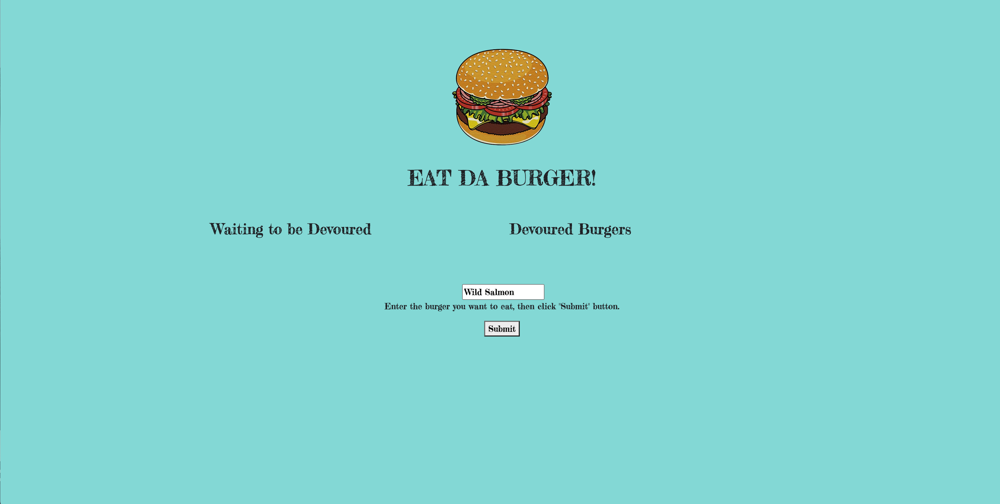
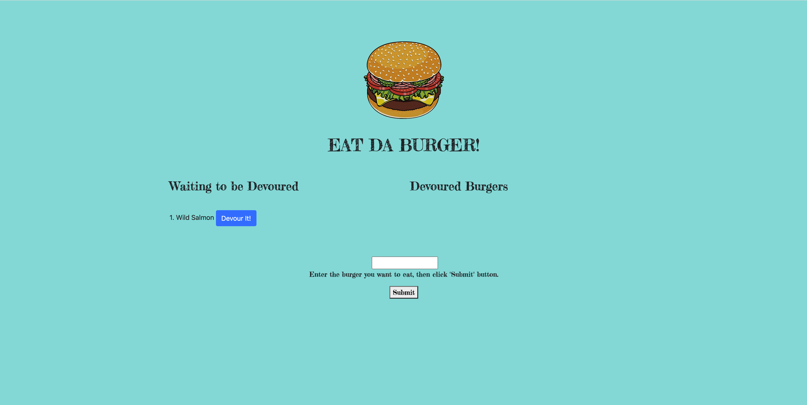
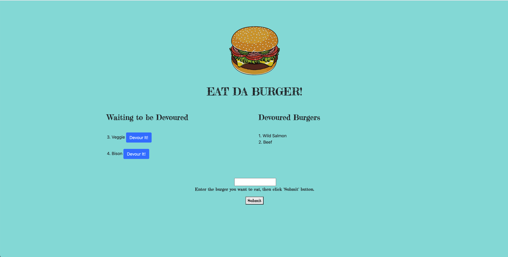
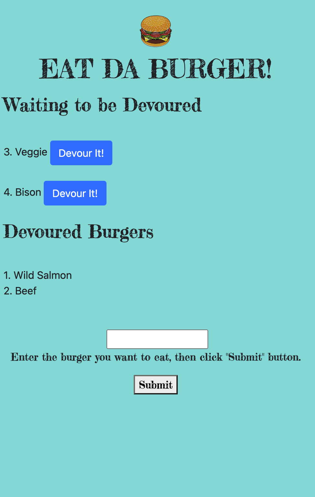

# Burger 

## Table of Content

* [Installation Instructions](#Installation-Instruction)
* [Description](#Description )
* [Usage Information](#Usage-Information)
* [License](#License)
* [Contributing Guildline](#Contributing-Guildline)
* [Questions](#Questions)

## Installation Dependencies
* npm init | npm install body-parser, dotenv, express, express-handlebars, method-override, mysql, nodemon

## Description
* This project is a burger logger with MySQL, Node, Express, Handlebars and a ORM.

## Usage Information
* Eat-Da-Burger! is a restaurant app that lets users input the names of burgers they would like to eat. 

 

* Once the user submits a burger's name, the app will display the burger on the left side of the page -- waiting to be devoured.

 

* Each burger in the waiting area also has a "Devour it!" button. When the user clicks it, the burger will move to the right side of the pag.

 

* The app is also responsiveness.

 

## License

## Contributing Guildeline
* I encourage public contributions.

## Demonstration Video (coming soon)

  

### Link to Demonstration on YouTube: 
* https://www.youtube.com/watch?v=GxLNYTCOOY8&feature=youtu.be   

## Questions

  * Github user name :   saipurciful
  * Github link : https://github.com/Saipurciful
  * How to reach me with additional questions : https://github.com/Saipurciful

## Link to the project site. 
* https://evening-wildwood-75697.herokuapp.com/
